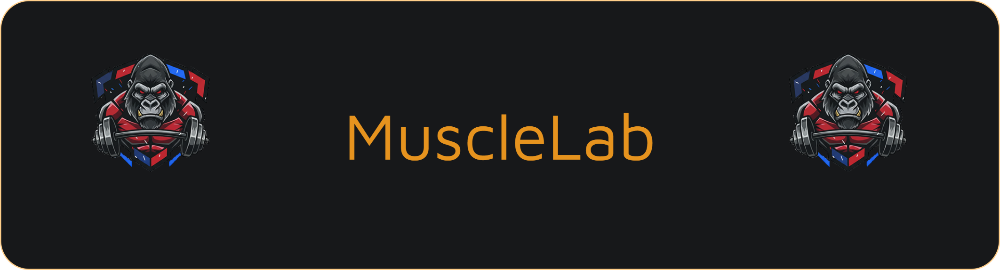

O **MuscleLab** é uma aplicação completa para entusiastas da musculação. O diferencial do projeto é a geração automática de fichas de treino personalizadas através de um quiz inteligente, além de um sistema de acesso restrito para cada usuário.

---

### 🚀 Tecnologias e Ferramentas

**Desenvolvimento:**
 
    

**Backend e Dados:**
 
  

---

### 🎯 Funcionalidades Implementadas

* **🔐 Sistema de Autenticação:** Login e Cadastro 100% funcionais com validação de credenciais no banco de dados.
* **📝 Quiz de Treino:** Algoritmo que processa as respostas do usuário (objetivo, nível e frequência) para gerar uma rotina de exercícios específica.
* **📅 Check-in:** Sistema de registro de presença nos treinos para controle de constância.
* **🛡️ Áreas Restritas:** Proteção de rotas para garantir que apenas usuários logados acessem suas fichas.

---

### 🗄️ Estrutura de Dados
O banco de dados MySQL foi estruturado para gerenciar:
- **Tabela de Usuários:** Armazenamento de nomes, e-mails e senhas (criptografadas).
- **Tabela de Treinos:** Relacionamento entre o ID do usuário e a ficha gerada pelo quiz.
